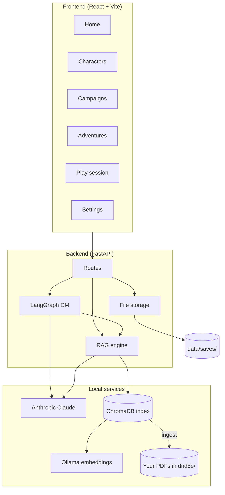
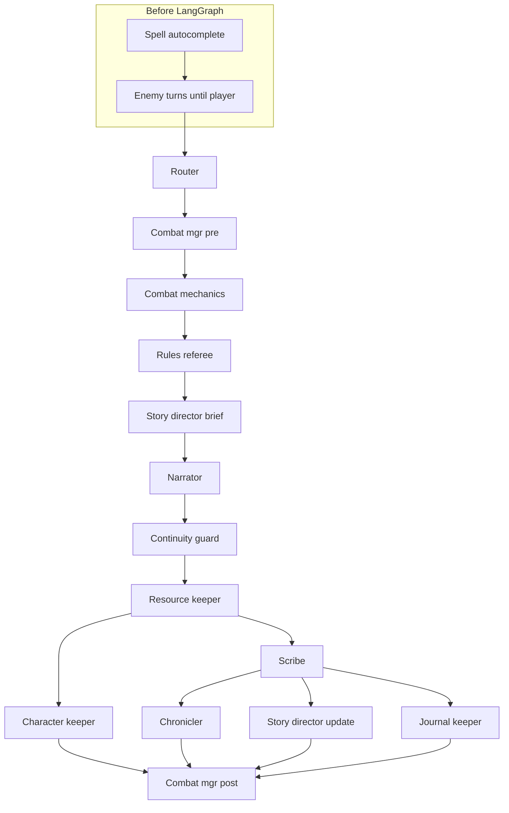
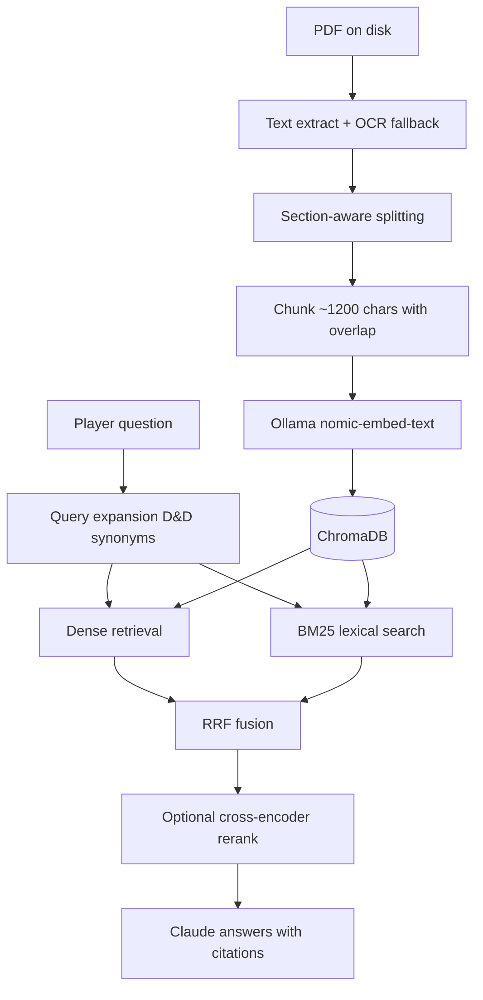
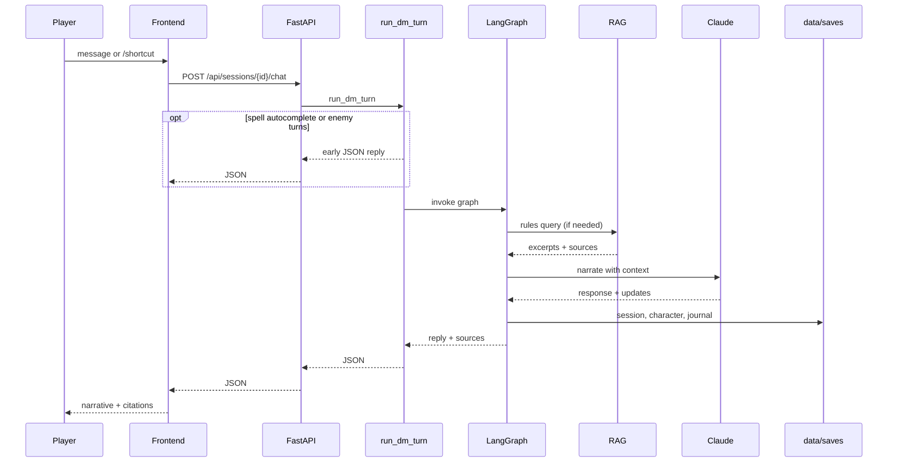

# Auto-DM

**An educational solo-play project:** a web app that acts as an automated Dungeon Master for D&D 5e (2024), with rules lookup, character sheets, campaign arcs, and persistent adventures.

This repo is meant for learning how to combine **LLM agents**, **RAG over PDFs**, and a **small full-stack app** into one playable system. It is not an official Wizards of the Coast product, and **rulebook PDFs are not included** (see [Rulebooks](#rulebooks-you-must-provide-locally)).

Repository: [github.com/Celssi/auto-dm](https://github.com/Celssi/auto-dm)

---

## What you can learn here

| Topic | Where it lives |
|-------|----------------|
| LangGraph multi-step DM pipeline | `backend/dm/graph.py` |
| Pre-graph spell autocomplete & combat prep | `backend/games/dnd5e/dm/spell_autocomplete.py`, `combat_manager.py` |
| RAG: chunk → embed → hybrid search → rerank | `backend/rag/` |
| OCR for scanned rulebook pages | `backend/rag/ocr.py` |
| Game plugin registry (extensible rulesets) | `backend/games/` |
| Curated YAML for character creation | `data/curated/` |
| Campaign & adventure bootstrap | `backend/dm/campaign_bootstrap.py`, `backend/routes/play.py` |
| Story director (spoiler-free checkpoints) | `backend/dm/story_director.py` |
| FastAPI REST API | `backend/routes/` |
| React wizard, campaigns UI & play session | `frontend/src/` |
| File-based campaign journal | `backend/dm/journal_keeper.py`, `backend/journal_storage.py` |
| PHB glossary tooltips | `backend/glossary.py`, `frontend/src/context/GlossaryContext.tsx` |

---

## System overview



When you send a message during play, the backend may resolve spell confirmations or enemy turns first, then runs a **fixed LangGraph pipeline** of specialist steps (combat math, rules lookup, narration, logging) before returning a JSON reply.

---

## DM turn pipeline

Each player message eventually flows through a LangGraph graph. Two steps run **before** the graph in `run_dm_turn`:

1. **Spell autocomplete** — fuzzy `/cast` names can short-circuit the graph with a confirmation prompt.
2. **Enemy turns** — if combat is active and it is not the player's turn, enemies act until control returns to the player.

Post-narrator bookkeeping nodes run in parallel where possible.



| Node | Role |
|------|------|
| **Router** | Detects shortcuts (`/attack_roll`, `/cast`, oracles), combat mode, rules questions |
| **Combat mgr pre** | Sets up combat state and planned encounters |
| **Combat mechanics** | Resolves dice shortcuts and mechanical summaries |
| **Rules referee** | Queries RAG when rules context is needed |
| **Story director brief** | Loads story outline and progress for the narrator |
| **Narrator** | Claude writes the in-character response |
| **Continuity guard** | Flags contradictions with adventure/character state |
| **Resource keeper** | Tracks spell slots, HP changes, rests |
| **Character keeper** | Applies sheet updates from the turn |
| **Scribe** | Writes structured lonelog lines |
| **Chronicler** | Updates adventure summary (skipped for short responses) |
| **Story director update** | Updates story progress checkpoints (skipped for short responses) |
| **Journal keeper** | Syncs NPCs, locations, and log entries to disk |
| **Combat mgr post** | Finalizes combat turn, applies end-of-turn effects |

---

## Rules lookup (RAG)

Rulebooks are **not** sent to the model whole. They are chunked, embedded, and searched at query time.



**Ingest** (first run can take hours for OCR):

```bash
./scripts/ingest-full.sh              # PHB + DMG + MM + Faerûn (OCR cache shared ingest → audit)
./scripts/ingest-full.sh --ocr         # force re-OCR on ingest only; audit still uses cache
./scripts/ingest-full.sh --no-ocr      # native PDF text only (faster, worse on scanned pages)
./scripts/ingest-full.sh --skip-audit   # ingest only, no YAML audit
```

OCR progress shows page counts, elapsed time, and ETA. Cached OCR lives in `data/ocr_cache/` (gitignored).

---

## Project layout

```
auto-dm/
├── backend/
│   ├── dm/              # LangGraph DM, story director, journal, combat hooks
│   ├── games/           # Game plugins (dnd5e: characters, combat, shortcuts)
│   ├── rag/             # Ingest, OCR, retrieval, query engine
│   └── routes/          # FastAPI endpoints (characters, campaigns, adventures, sessions, play)
├── frontend/            # React UI (Vite, Tailwind)
├── data/
│   ├── curated/         # YAML: classes, spells, backgrounds, …
│   ├── chroma/          # vector index (generated)
│   ├── ocr_cache/       # OCR JSON cache (generated)
│   └── saves/           # characters, campaigns, adventures, sessions (local)
├── dnd5e/               # place your PDFs here (not in git)
└── scripts/             # ingest, audit, start-app, validators
```

---

## Requirements

- **Python 3.11+**
- **Node.js 18+**
- **[Ollama](https://ollama.com)** with `nomic-embed-text` (local embeddings)
- **[Tesseract](https://github.com/tesseract-ocr/tesseract)** (OCR for image-heavy PHB/MM pages)
- **Anthropic API key** (Claude for narration and rules answers)

---

## Quick start

### 1. Clone and install

```bash
git clone https://github.com/Celssi/auto-dm.git
cd auto-dm

python -m venv .venv && source .venv/bin/activate
pip install -e .

ollama pull nomic-embed-text
brew install tesseract   # macOS; use your OS package manager elsewhere
```

### 2. Configure

```bash
cp .env.example .env
# Edit .env and set ANTHROPIC_API_KEY
```

### 3. Add rulebooks

See [Rulebooks](#rulebooks-you-must-provide-locally).

### 4. Index PDFs

```bash
python -m scripts.ingest --core
# Optional supplements:
python -m scripts.ingest --include-faerun
```

Or use the full script (ingest + curated audit):

```bash
./scripts/ingest-full.sh
```

### 5. Frontend

```bash
cd frontend && npm install && cd ..
```

### 6. Run

**Both servers at once:**

```bash
./scripts/start-app.sh
```

**Or manually:**

```bash
# Terminal 1 — API
uvicorn backend.main:app --reload --port 8000

# Terminal 2 — UI
cd frontend && npm run dev
```

Open **http://localhost:5173**

For a single-process setup, build the frontend (`cd frontend && npm run build`) and run only uvicorn — FastAPI serves `frontend/dist` when present.

---

## Rulebooks (you must provide locally)

Place legally obtained PDFs in `dnd5e/`:

| File | Book |
|------|------|
| `player.pdf` | Player's Handbook (2024) |
| `dm.pdf` | Dungeon Master's Guide (2024) |
| `monsters.pdf` | Monster Manual (2024) |
| `heroes_faerun.pdf` | Heroes of Faerûn *(optional)* |
| `adventures_faerun.pdf` | Adventures in Faerûn *(optional)* |

These files are **gitignored** on purpose. The curated YAML in `data/curated/` covers character creation; RAG covers open-ended rules and adventure text.

---

## Features

- **Solo play session** — chat UI, dice shortcuts, oracles, spell autocomplete, combat sidebar
- **Character builder** — 12 PHB 2024 classes, level-up, multiclass, PDF sheet export
- **Campaigns** — multi-adventure arcs, story bible, NPC/location journal, AI campaign generation, copy/repair tools
- **Adventures** — outlines, story-director checkpoints (player-safe progress), planned encounters
- **Combat** — initiative, enemy turns, concentration, planned encounter triggers from outlines
- **Rules search** — hybrid dense + lexical retrieval, optional reranking, citations in play
- **Glossary** — PHB term tooltips in character sheet and play UI
- **Faerûn mode** — optional supplement data and RAG factions
- **Settings** — reindex, Faerûn toggle, rerank preference

---

## Useful commands

```bash
# Validate curated character data
python -m scripts.validate_dnd5e_character

# Audit YAML structure (fast)
python -m scripts.audit_curated --skip-pdf

# Audit YAML against PDF backgrounds (slow; needs index/OCR)
python -m scripts.audit_curated --include-faerun

# Run backend tests
pytest backend/tests/
```

---

## Data flow during play



Shortcut rolls and oracles use separate session endpoints (`/api/sessions/{id}/shortcut`, `/api/sessions/{id}/oracle`). Campaign and adventure bootstrap use `/api/play/*`.

---

## Educational notes

**Why two models?** Embeddings run locally via Ollama (cheap, private, good for bulk ingest). Claude handles nuanced narration and rules synthesis where quality matters.

**Why YAML + RAG?** Structured character options (class features, spell lists) are faster and more reliable from curated data. Open-ended questions (“how does grappling work on a mount?”) need semantic search over the books.

**Why LangGraph?** A structured pipeline keeps each concern testable: you can inspect combat output before narration, or skip RAG when the player just rolls dice. Post-narrator bookkeeping nodes fan out in parallel to reduce latency.

**Why campaigns + adventures?** A campaign holds long-lived world state (NPCs, locations, story arc). Adventures are playable episodes with hidden DM outlines and checkpoint progress so the narrator can advance plot without spoiling future beats.

**First ingest is slow** because PHB/MM pages are often scanned; Tesseract OCR at 300 DPI is CPU-heavy. Re-runs use `data/ocr_cache/`.

---

## Disclaimer

This project is for **learning and personal solo play**. D&D and related marks are property of Wizards of the Coast. Do not commit copyrighted PDFs or redistribute book content. Respect your local laws and Wizards’ fan content guidelines.

---

## License

Source code in this repository is provided as an educational reference unless a separate license file is added. Third-party dependencies have their own licenses.
